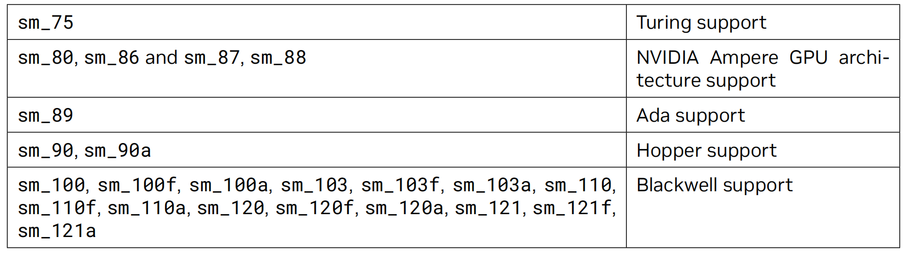
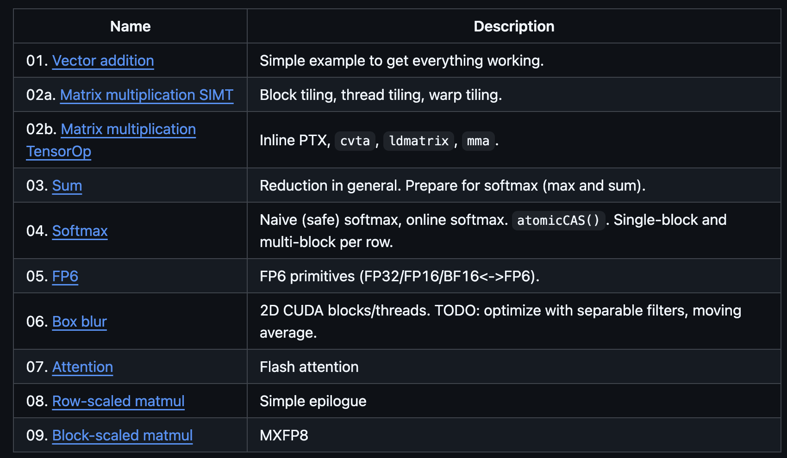
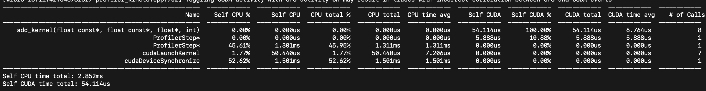
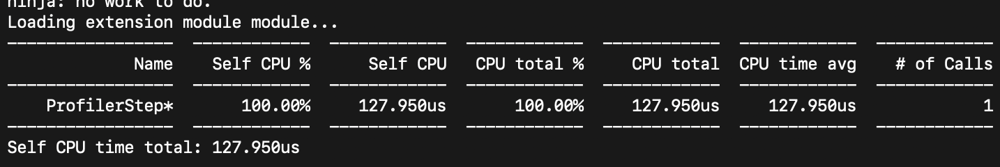
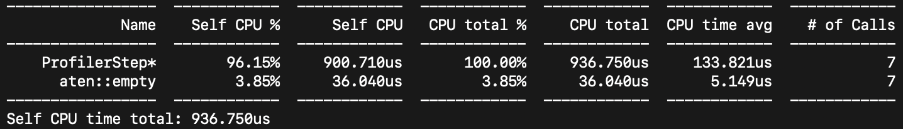
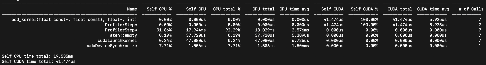
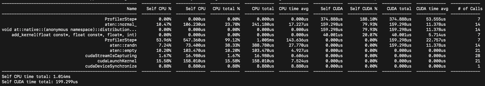

## Topic: GPU+PyTorch+Triton Starting Tutorial

---

### 0. Hardware Information

> **Hardware**: ```NVIDIA A100```
>
> **Driver**: ```cuda_12.3.r12.3/compiler.33281558_0```

表： GPU硬件的信息汇总

| 架构          | GPU型号    | 计算能力 | `-arch`参数   | 备注               | CUDA版本要求 |
| :------------ | :--------- | :------- | :------------ | :----------------- | ------------ |
| **Volta**     | V100       | 7.0      | `-arch=sm_70` | 数据中心卡         | 9.0+         |
| **Volta**     | Titan V    | 7.0      | `-arch=sm_70` | 消费级卡           | 9.0+         |
| **Ampere**    | A100       | 8.0      | `-arch=sm_80` | 数据中心卡         | 11.0+        |
| **Ampere**    | A30        | 8.0      | `-arch=sm_80` | 数据中心卡         | 11.0+        |
| **Ampere**    | RTX 30系列 | 8.6      | `-arch=sm_86` | 消费级卡           | 11.0+        |
| **Hopper**    | H100       | 9.0      | `-arch=sm_90` | 数据中心卡         | 11.8+        |
| **Blackwell** | B200       | 9.0+     | `-arch=sm_90` | 目前使用Hopper参数 | 12.0+        |



(From NVIDIA CUDA Compiler Driver, same with PTX)

### 1. Building Environment

```bash
wget https://repo.anaconda.com/miniconda/Miniconda3-latest-Linux-x86_64.sh
bash ~/Miniconda3-latest-Linux-x86_64.sh
```

### 2. PyTorch + Triton + vLLM

```bash
pip3 install torch torchvision --index-url https://download.pytorch.org/whl/cu121
```

```bash
pip install triton==3.4.0
```

```bash
pip install vllm==0.9.2
```

**Verify the installations**: 

```python
# 验证脚本 verify_installation.py
import torch
import triton
import vllm

print(f"PyTorch 版本: {torch.__version__}")
print(f"PyTorch CUDA 可用: {torch.cuda.is_available()}")
print(f"PyTorch CUDA 版本: {torch.version.cuda}")
print(f"Triton 版本: {triton.__version__}")
print(f"vLLM 版本: {vllm.__version__}")

# 测试GPU计算
if torch.cuda.is_available():
    device = "cuda"
    x = torch.tensor([1.0, 2.0, 3.0]).to(device)
    y = x * 2
    print(f"GPU计算测试成功: {y}")
else:
    print("CUDA不可用！")
```

### 3. CUDA编程基础

 CUDA相关的编程编译流程可以总结为如下流程图：


"Hello World"样例代码：

```c++
// add.cu
#include <iostream>
#include <math.h>
 
// Kernel function to add the elements of two arrays
__global__
void add(int n, float *x, float *y)
{
 for (int i = 0; i < n; i++)
   y[i] = x[i] + y[i];
}
 
int main(void)
{
 int N = 1<<20;
 float *x, *y;
 
 // Allocate Unified Memory – accessible from CPU or GPU
 cudaMallocManaged(&x, N*sizeof(float));
 cudaMallocManaged(&y, N*sizeof(float));
 
 // initialize x and y arrays on the host
 for (int i = 0; i < N; i++) {
   x[i] = 1.0f;
   y[i] = 2.0f;
 }
 
 // Run kernel on 1M elements on the GPU
 add<<<1, 1>>>(N, x, y);
 
 // Wait for GPU to finish before accessing on host
 cudaDeviceSynchronize();
 
 // Check for errors (all values should be 3.0f)
 float maxError = 0.0f;
 for (int i = 0; i < N; i++) {
   maxError = fmax(maxError, fabs(y[i]-3.0f));
 }
 std::cout << "Max error: " << maxError << std::endl;
 
 // Free memory
 cudaFree(x);
 cudaFree(y);
  return 0;
}
```


#### (1) Kernel Function: 设备侧函数主要以```__global__```关键词修饰

```c++
__global__ add(int n, float* x, float* y) {
  for (int i = 0; i < n; ++i) {
    y[i] = x[i] + y[i];
  }
}
```

#### (2) Unified Memory: host-device统一编址的显存分配，利用```cudaMallocManaged()```分配统一内存，返回可访问的指针，```kernel```执行完毕需要手动利用```cudaFree()```释放内存（```cudaMallocManaged-cudaFree```和标准```C++```中的```new-delete```对应）

```c++
// Allocate Unified Memory -- accessible from CPU or GPU
float *x, *y, *sum;
cudaMallocManaged(&x, N*sizeof(float));
cudaMallocManaged(&y, N*sizeof(float));
 
...
 
// Free memory
cudaFree(x);
cudaFree(y);
```

#### (3) Kernal Launch: 从host侧启动Kernel函数，使用cuda的三重角度括号语法```<<<Dg, Db, Ns, S>>>```

> **注释**：
>
> (a) ```Dg```代表整个grid的尺寸（一个grid有多少个block），数据类型为dim3，例如：Dim3 Dg(Dg.x, Dg.y, 1)代表grid中每行有Dg.x个block，每列有Dg.y个block，第三个纬度恒定为1，因此整个grid一共有```Dg.x * Dg.y```个block，且$Dg.x, Dg.y <=  65535$;
>
> (b) Db定义一个block的尺寸（一个block有多少thread），数据类型为dim3，例如：Dim3 Db(Db.x, Db.y, Db.z)代表block中每行有Db.x个thread，每列有Db.y个thread，高度方向有Db.z个thread，因此一个block有$Db.x * Db.y * Db.z$个thread.
>
> (c) Ns为可选参数，用于设置每个block除了静态分配的共享内存外，最多能动态分配的共享内存大小，单位为Byte。如果不需要，则$Ns = 0$或者参数缺省.
>
> (d) S时cudaStream_t类型的可选参数，默认值为$S = 0$，标识核函数位于哪个stream中（指定核函数在哪个stream中执行）

```c++
// 代表一个block，一个thread
add<<<1, 1>>>(N, sum, x, y);
```

#### (4) nvcc编译

> **编译选项**：
>
> ​         ```--gpu-architecture```  :  指定virtual architecture(PTX),  例如：compute_80, compute_90
>
> ​         ```--gpu-code```: 指定real architecture, 例如：sm_80, sm_86

* 基础编译命令：直接得到可执行文件

```bash
nvcc -o add add.cu
```

* 指定平台：从V100, A100, H100到B200不同GPU型号，nvcc可以编译得到特定平台二进制、ptx指令或者通用平台指令（就是各个平台的指令打包）

```bash
# 查询当前使用GPU平台的卡型号等信息
nvidia-smi
# 查询当前使用的GPU平台的计算能力
nvidia-smi --query-gpu=compute_cap --format=csv
```

```bash
# 编译到特定平台

## (1) V100及所有计算能力7.0的GPU
nvcc -arch=sm_70 -o your_program your_program.cu
# 如果需要包含PTX代码以支持未来兼容性
nvcc -arch=sm_70 -gencode arch=compute_70,code=sm_70 -o your_program your_program.cu
## (2) A100及所有计算能力8.0的GPU
nvcc -arch=sm_80 -o your_program your_program.cu
# 如果需要包含PTX代码以支持未来兼容性
nvcc -arch=sm_80 -gencode arch=compute_80,code=sm_80 -o your_program your_program.cu
## (3) H100及所有计算能力9.0的GPU
nvcc -arch=sm_90 -o your_program your_program.cu
# 如果需要包含PTX代码以支持未来兼容性
nvcc -arch=sm_90 -gencode arch=compute_90,code=sm_90 -o your_program your_program.cu
## (4) B200及所有计算能力9.0的GPU
nvcc -arch=sm_90 -o your_program your_program.cu
# 如果需要包含PTX代码以支持未来兼容性
nvcc -arch=sm_90 -gencode arch=compute_90,code=sm_90 -o your_program your_program.cu
```

```bash
# 编译到通用平台
# 支持V100到H100的通用二进制
nvcc -gencode arch=compute_70,code=sm_70 -gencode arch=compute_80,code=sm_80 -gencode arch=compute_90,code=sm_90 -o universal_program program.cu
```

当前使用的GPU硬件为A100，因此以上```add.cu```代表编译命令为：

```bash
nvcc -arch=sm_80 -o add add.cu
```

执行后得到结果：

```bash
(pytorch) lthpc@gnode02:~/chengl/Programming> ./add
Max error: 0
```

* CUDA编译基本设计原理

&emsp;为了尽可能提升CUDA代码的跨平台兼容性，CUDA的编译过程分别针对两级架构：```virtual intermediate architecture(VIA)```和```real GPU architecture(RGA)```. 两级架构的中间表示为```PTX```，```PTX```可以看做```VIA```的```Assembly code```和```RGA```的源代码，```PTX```的选择应该使```VIA```尽可能```low-level```，而```RGA```尽可能的```high-level```. 如果需要尽可能提高应用代码的可移植性(不确定GPU的平台)，可以采用```just-in-time```编译方式，但是```JIT```一个缺点是程序``startup delay``过长，解决该问题的两个方法分别是：`compilation cache`和`Fatbinaries`。

```shell
# JIT compilation
nvcc x.cu --gpu-architecture=compute_90 --gpu-code=compute_90
```

```shell
# Fatbinaries: This command generates exact code for two architectures, plus PTX code for use by JIT in case a next generation GPU is encountered.
nvcc x.cu --gpu-architecture=compute_80 --gpu-code=compute_80,sm_86,sm_89
```

&emsp;下面给出了CUDA代码常规两级编译流程和```JIT```编译流程示意图。

（1）CUDA代码常规两级编译流程

```mermaid
graph TD
    A[源代码] --> B[预处理]
    B --> C[编译为PTX中间代码]
    C --> D{编译模式}
    D -->|整体程序编译| E[直接生成可执行文件]
    D -->|单独编译| F[汇编为SASS]
    F --> G[链接成最终二进制文件]
```



（2）JIT编译流程

```mermaid
graph TD
    A[源代码] --> B[代码解析]
    B --> C{中间表示}
    C -->|LLVM IR/PTX| D[动态优化]
    D --> E[机器码生成]
    E --> F[GPU执行]
    F --> G[结果输出]

    subgraph 编译流程
        C -->|PTX中间代码| H[编译器]
        H --> I[优化器]
        I --> J[代码生成器]
        J --> K[目标架构机器码]
    end

    subgraph 执行阶段
        K --> L[GPU执行引擎]
        L --> M[线程调度]
        M --> N[计算结果]
    end
```


#### (5) cuda原生性能Profiling采集工具: ```nsys```

* 直接采集完整性能统计数据

```bash
nsys profile -t cuda --stats=true ./add
```

结果会生成如下详细性能信息：包括内存分配（```cudaMallocManaged```），同步，内存释放，Kernel启动时间，Kernel执行时间等

```bash
(pytorch) lthpc@gnode02:~/chengl/Programming> nsys profile -t cuda --stats=true ./add
Max error: 0
Generating '/tmp/nsys-report-94b0.qdstrm'
[1/6] [========================100%] report2.nsys-rep
[2/6] [========================100%] report2.sqlite
[3/6] Executing 'cuda_api_sum' stats report

 Time (%)  Total Time (ns)  Num Calls    Avg (ns)       Med (ns)      Min (ns)     Max (ns)     StdDev (ns)            Name         
 --------  ---------------  ---------  -------------  -------------  -----------  -----------  -------------  ----------------------
     64.2      308,780,682          2  154,390,341.0  154,390,341.0       19,020  308,761,662  218,314,015.8  cudaMallocManaged     
     35.7      171,461,980          1  171,461,980.0  171,461,980.0  171,461,980  171,461,980            0.0  cudaDeviceSynchronize 
      0.1          468,500          2      234,250.0      234,250.0      183,820      284,680       71,318.8  cudaFree              
      0.0          197,110          1      197,110.0      197,110.0      197,110      197,110            0.0  cudaLaunchKernel      
      0.0              840          1          840.0          840.0          840          840            0.0  cuModuleGetLoadingMode

[4/6] Executing 'cuda_gpu_kern_sum' stats report

 Time (%)  Total Time (ns)  Instances    Avg (ns)       Med (ns)      Min (ns)     Max (ns)    StdDev (ns)             Name           
 --------  ---------------  ---------  -------------  -------------  -----------  -----------  -----------  --------------------------
    100.0      171,458,500          1  171,458,500.0  171,458,500.0  171,458,500  171,458,500          0.0  add(int, float *, float *)

[5/6] Executing 'cuda_gpu_mem_time_sum' stats report

 Time (%)  Total Time (ns)  Count  Avg (ns)  Med (ns)  Min (ns)  Max (ns)  StdDev (ns)               Operation              
 --------  ---------------  -----  --------  --------  --------  --------  -----------  ------------------------------------
     61.3          978,906     48  20,393.9   6,575.5     3,679   105,411     29,701.5  [CUDA memcpy Unified Host-to-Device]
     38.7          617,794     24  25,741.4   5,167.5     2,655   151,107     43,848.0  [CUDA memcpy Unified Device-to-Host]

[6/6] Executing 'cuda_gpu_mem_size_sum' stats report

 Total (MB)  Count  Avg (MB)  Med (MB)  Min (MB)  Max (MB)  StdDev (MB)               Operation              
 ----------  -----  --------  --------  --------  --------  -----------  ------------------------------------
      8.389     48     0.175     0.033     0.004     1.044        0.304  [CUDA memcpy Unified Host-to-Device]
      4.194     24     0.175     0.033     0.004     1.044        0.307  [CUDA memcpy Unified Device-to-Host]

Generated:
    /home/lthpc/chengl/Programming/report2.nsys-rep
    /home/lthpc/chengl/Programming/report2.sqlite
```

* 简化性能统计信息：[Mark Harris](https://developer.nvidia.com/zh-cn/blog/author/mark-harris/) 写了一个简单的nsys_easy脚本(https://github.com/harrism/nsys_easy)，用来简化输出信息

```bash
# 修改执行权限
chmod 755 ~/nsys_easy/nsys_easy
# 添加nsys_easy环境变量
export PATH=~/nsys_easy:$PATH
# 采集性能信息
nsys_easy ./add
```

结果会生成如下简化信息：
```bash
(pytorch) lthpc@gnode02:~/chengl/Programming> nsys_easy ./add
Max error: 0
Generating '/tmp/nsys-report-66ad.qdstrm'
[1/1] [========================100%] nsys_easy.nsys-rep
Generated:
    /home/lthpc/chengl/Programming/nsys_easy.nsys-rep
Generating SQLite file nsys_easy.sqlite from nsys_easy.nsys-rep
Processing 939 events: [===================================================100%]
Processing [nsys_easy.sqlite] with [/home/software/cuda-12.3/nsight-systems-2023.3.3/host-linux-x64/reports/cuda_gpu_sum.py]... 

 ** CUDA GPU Summary (Kernels/MemOps) (cuda_gpu_sum):

 Time (%)  Total Time (ns)  Instances    Avg (ns)       Med (ns)      Min (ns)     Max (ns)    StdDev (ns)   Category                 Operation              
 --------  ---------------  ---------  -------------  -------------  -----------  -----------  -----------  -----------  ------------------------------------
     99.1      172,191,985          1  172,191,985.0  172,191,985.0  172,191,985  172,191,985          0.0  CUDA_KERNEL  add(int, float *, float *)          
      0.6          979,518         48       20,406.6        6,527.5        3,647      105,666     29,680.1  MEMORY_OPER  [CUDA memcpy Unified Host-to-Device]
      0.4          618,691         24       25,778.8        5,199.5        2,495      151,235     43,882.6  MEMORY_OPER  [CUDA memcpy Unified Device-to-Host]
```

#### (6) PyTorch + CUDA原生集成开发 + pyTorch统一性能Profiling采集工具：```torch.profiler```

&emsp;参考PyTorch官网说明：https://docs.pytorch.org/docs/stable/profiler.html

&emsp;目前LLM基本都是在PyTorch的pythonic环境下开发使用，为了实现CUDA函数在PyTorch的自然集成，需要用到```torch.utils.cpp_extension```和```torch/extension.h```，并利用```pybind11```完成pytorch下对CUDA-C/C++函数的调用。https://github.com/gau-nernst/learn-cuda中了给了10个示例教程，这里给出```01-vector addition```的代码示例。



```c++
// add.cu
#include <torch/extension.h>

#define CHECK_CUDA(x) TORCH_CHECK(x.device().is_cuda(), #x " must be a CUDA tensor")
#define CHECK_CONTIGUOUS(x) TORCH_CHECK(x.is_contiguous(), #x " must be contiguous")
#define CHECK_INPUT(x)                                                                                                 \
  CHECK_CUDA(x);                                                                                                       \
  CHECK_CONTIGUOUS(x)

__global__ void add_kernel(const float *input1, const float *input2, float *output, int size) {
  const int idx = blockIdx.x * blockDim.x + threadIdx.x;
  if (idx < size)
    output[idx] = input1[idx] + input2[idx];
}

torch::Tensor add(torch::Tensor input1, torch::Tensor input2) {
  CHECK_INPUT(input1);
  CHECK_INPUT(input2);
  int size = input1.numel();
  TORCH_CHECK(size == input2.numel(), "input1 and input2 must have the same size");
  torch::Tensor output = torch::empty(size, input1.options());

  int n_threads = 256;
  int n_blocks = (size + n_threads - 1) / n_threads;
  add_kernel<<<n_blocks, n_threads>>>(input1.data_ptr<float>(), input2.data_ptr<float>(), output.data_ptr<float>(), size);

  return output;
}

PYBIND11_MODULE(TORCH_EXTENSION_NAME, m) { m.def("add", &add, "Add two vectors"); }
```

&emsp;实际上就是添加了一个tensor的wrapper，因为tensor是pytorch的基础数据类型，因此核心步骤就是将原始cuda的入参和返回参数等转成tensor（指针），传给torch实现包装。下面是pytorch中的调用代码（可以看到就是重新声明了cuda函数，将其归类为一类module，从而下面可以直接从module中调用原始封装后的cuda函数，如果需要将函数注册进torch，即torch.add，后续会涉及）：

```python
# main.py
import torch
import torch.utils.cpp_extension
from torch.profiler import profile, record_function, ProfilerActivity
import matplotlib.pyplot as plt

module = torch.utils.cpp_extension.load(
    "module",
    sources=["add.cu"],
    extra_cuda_cflags=["-O3"],
    verbose=True,
)

# Example usage
input1 = torch.randn(1024000, device="cuda")
input2 = torch.randn(1024000, device="cuda")
output = module.add(input1, input2)
```

&emsp;下面给出torch.profiler采集以上封装后的cuda函数方法。

* **(a) 最基础的```torch.profiler```裸测试调用采集性能数据**

```python
# 核心结构
from torch.profiler import profile, record_function, ProfilerActivity
with torch.profiler.profile(
    activities=[
        torch.profiler.ProfilerActivity.CPU,
        torch.profiler.ProfilerActivity.CUDA,
    ]
) as p:
    code_to_profile() # 替换成需要采集的torch代码（函数）
print(p.key_averages().table(sort_by="self_cuda_time_total", row_limit=-1))
```

完整测试代码如下：

```python
import torch
import torch.utils.cpp_extension
from torch.profiler import profile, record_function, ProfilerActivity
import matplotlib.pyplot as plt

module = torch.utils.cpp_extension.load(
    "module",
    sources=["add.cu"],
    extra_cuda_cflags=["-O3"],
    verbose=True,
)

# Example usage
input1 = torch.randn(1024000, device="cuda")
input2 = torch.randn(1024000, device="cuda")

with torch.profiler.profile(
    activities=[
        torch.profiler.ProfilerActivity.CPU,
        torch.profiler.ProfilerActivity.CUDA,
    ]
) as p:
    output = module.add(input1, input2)
print(p.key_averages().table(sort_by="self_cuda_time_total", row_limit=-1))
p.export_chrome_trace("trace.json")  # 可以生成程序运行的timeline
```

运行后的结果如下：

```bash
(pytorch) lthpc@gnode02:~/chengl/Programming/learn-cuda/1_vector_addition> CUDA_VISIBLE_DEVICES=0 python main.py 
Using /home/lthpc/.cache/torch_extensions/py310_cu126 as PyTorch extensions root...
Detected CUDA files, patching ldflags
Emitting ninja build file /home/lthpc/.cache/torch_extensions/py310_cu126/module/build.ninja...
Building extension module module...
Allowing ninja to set a default number of workers... (overridable by setting the environment variable MAX_JOBS=N)
ninja: no work to do.
Loading extension module module...
-------------------------------------------------------  ------------  ------------  ------------  ------------  ------------  ------------  ------------  ------------  ------------  ------------  
                                                   Name    Self CPU %      Self CPU   CPU total %     CPU total  CPU time avg     Self CUDA   Self CUDA %    CUDA total  CUDA time avg    # of Calls  
-------------------------------------------------------  ------------  ------------  ------------  ------------  ------------  ------------  ------------  ------------  ------------  ------------  
    add_kernel(float const*, float const*, float*, int)         0.00%       0.000us         0.00%       0.000us       0.000us       9.824us       100.00%       9.824us       9.824us             1  
                                            aten::empty         5.96%      52.520us        75.63%     666.350us     666.350us       0.000us         0.00%       0.000us       0.000us             1  
                                           Unrecognized        69.67%     613.830us        69.67%     613.830us     613.830us       0.000us         0.00%       0.000us       0.000us             1  
                                       cudaLaunchKernel         8.46%      74.530us        23.81%     209.810us     209.810us       0.000us         0.00%       0.000us       0.000us             1  
                       Runtime Triggered Module Loading        15.35%     135.280us        15.35%     135.280us      67.640us       0.000us         0.00%       0.000us       0.000us             2  
                                  cudaDeviceSynchronize         0.56%       4.910us         0.56%       4.910us       4.910us       0.000us         0.00%       0.000us       0.000us             1  
-------------------------------------------------------  ------------  ------------  ------------  ------------  ------------  ------------  ------------  ------------  ------------  ------------  
Self CPU time total: 881.070us
Self CUDA time total: 9.824us
```

&emsp;从上面列表中找到```Name = add_kernel```对应的```Self CUDA= 9.824us```即为GPU上add_kernel执行的完整时间，下面还可以发现```cudaLaunchKernel```代表从host侧启动GPU侧核函数花费时间为```209.810us```，可以看到远远长于Kernel本身在GPU上执行时间。

* **(b) 考虑预热等因素后的```torch.profiler```调用性能采集方法**

```python
# 核心结构
with torch.profiler.profile(
    activities=[
        torch.profiler.ProfilerActivity.CPU,
        torch.profiler.ProfilerActivity.CUDA,
    ]
) as p:
    code_to_profile_0()
    // turn off collection of all CUDA activity
    p.toggle_collection_dynamic(False, [torch.profiler.ProfilerActivity.CUDA])
    code_to_profile_1()
    // turn on collection of all CUDA activity
    p.toggle_collection_dynamic(True, [torch.profiler.ProfilerActivity.CUDA])
    code_to_profile_2()
print(p.key_averages().table(sort_by="self_cuda_time_total", row_limit=-1))
```

完整测试代码：

```python
import torch
import torch.utils.cpp_extension
from torch.profiler import profile, record_function, ProfilerActivity
import matplotlib.pyplot as plt

module = torch.utils.cpp_extension.load(
    "module",
    sources=["add.cu"],
    extra_cuda_cflags=["-O3"],
    verbose=True,
)

# Example usage
input1 = torch.randn(1024000, device="cuda")
input2 = torch.randn(1024000, device="cuda")

# Non-default profiler schedule allows user to turn profiler on and off
# on different iterations of the training loop;
# trace_handler is called every time a new trace becomes available
def trace_handler(prof):
    print(
        prof.key_averages().table(sort_by="self_cuda_time_total", row_limit=-1)
    )
    prof.export_chrome_trace("/tmp/test_trace_" + str(prof.step_num) + ".json")

with torch.profiler.profile(
    activities=[
        torch.profiler.ProfilerActivity.CPU,
        torch.profiler.ProfilerActivity.CUDA,
    ],
    # In this example with wait=1, warmup=1, active=2, repeat=1,
    # profiler will skip the first step/iteration,
    # start warming up on the second, record
    # the third and the forth iterations,
    # after which the trace will become available
    # and on_trace_ready (when set) is called;
    # the cycle repeats starting with the next step
    schedule=torch.profiler.schedule(wait=1, warmup=1, active=7, repeat=1),
    on_trace_ready=trace_handler,
    record_shapes=True,
    # on_trace_ready=torch.profiler.tensorboard_trace_handler('./log')
    # used when outputting for tensorboard
) as p:
    for iter in range(10):
        output = module.add(input1, input2)
        # send a signal to the profiler that the next iteration has started
        p.step()
```

采集结果如下：

```shell
(pytorch) lthpc@gnode02:~/chengl/Programming/learn-cuda/1_vector_addition> CUDA_VISIBLE_DEVICES=0 python main.py 
Using /home/lthpc/.cache/torch_extensions/py310_cu126 as PyTorch extensions root...
Detected CUDA files, patching ldflags
Emitting ninja build file /home/lthpc/.cache/torch_extensions/py310_cu126/module/build.ninja...
Building extension module module...
Allowing ninja to set a default number of workers... (overridable by setting the environment variable MAX_JOBS=N)
ninja: no work to do.
Loading extension module module...
-------------------------------------------------------  ------------  ------------  ------------  ------------  ------------  ------------  ------------  ------------  ------------  ------------  
                                                   Name    Self CPU %      Self CPU   CPU total %     CPU total  CPU time avg     Self CUDA   Self CUDA %    CUDA total  CUDA time avg    # of Calls  
-------------------------------------------------------  ------------  ------------  ------------  ------------  ------------  ------------  ------------  ------------  ------------  ------------  
    add_kernel(float const*, float const*, float*, int)         0.00%       0.000us         0.00%       0.000us       0.000us      45.956us       100.00%      45.956us       6.565us             7  
                                          ProfilerStep*         0.00%       0.000us         0.00%       0.000us       0.000us      45.956us       100.00%      45.956us       6.565us             7  
                                          ProfilerStep*        71.61%     380.100us        96.98%     514.710us      73.530us       0.000us         0.00%       0.000us       0.000us             7  
                                            aten::empty        12.90%      68.450us        12.90%      68.450us       9.779us       0.000us         0.00%       0.000us       0.000us             7  
                                       cudaLaunchKernel        12.47%      66.160us        12.47%      66.160us       9.451us       0.000us         0.00%       0.000us       0.000us             7  
                                  cudaDeviceSynchronize         3.02%      16.050us         3.02%      16.050us      16.050us       0.000us         0.00%       0.000us       0.000us             1  
-------------------------------------------------------  ------------  ------------  ------------  ------------  ------------  ------------  ------------  ------------  ------------  ------------  
Self CPU time total: 530.760us
Self CUDA time total: 45.956us
```

&emsp;可以看到考虑预热和多次平均后的```add_kernel```时间为```6.565us```，并且多次运行时间差别也不大。

**(c) 考虑预热等因素 + 仅采集部分代码的```torch.profiler```调用性能采集方法：```toggle_collection_dynamic```**

```python
with torch.profiler.profile(
    activities=[
        torch.profiler.ProfilerActivity.CPU,
        torch.profiler.ProfilerActivity.CUDA,
    ]
) as p:
    code_to_profile_0()
    // turn off collection of all CUDA activity
    p.toggle_collection_dynamic(False, [torch.profiler.ProfilerActivity.CUDA])
    code_to_profile_1()
    // turn on collection of all CUDA activity
    p.toggle_collection_dynamic(True, [torch.profiler.ProfilerActivity.CUDA])
    code_to_profile_2()
print(p.key_averages().table(sort_by="self_cuda_time_total", row_limit=-1))
```

完整代码如下：

```python
import torch
import torch.utils.cpp_extension
from torch.profiler import profile, record_function, ProfilerActivity
import matplotlib.pyplot as plt

module = torch.utils.cpp_extension.load(
    "module",
    sources=["add.cu"],
    extra_cuda_cflags=["-O3"],
    verbose=True,
)

# Non-default profiler schedule allows user to turn profiler on and off
# on different iterations of the training loop;
# trace_handler is called every time a new trace becomes available
def trace_handler(prof):
    print(
        prof.key_averages().table(sort_by="self_cuda_time_total", row_limit=-1)
    )
    prof.export_chrome_trace("/tmp/test_trace_" + str(prof.step_num) + ".json")

with torch.profiler.profile(
    activities=[
        torch.profiler.ProfilerActivity.CPU,
        torch.profiler.ProfilerActivity.CUDA,
    ],
    # In this example with wait=1, warmup=1, active=2, repeat=1,
    # profiler will skip the first step/iteration,
    # start warming up on the second, record
    # the third and the forth iterations,
    # after which the trace will become available
    # and on_trace_ready (when set) is called;
    # the cycle repeats starting with the next step
    schedule=torch.profiler.schedule(wait=1, warmup=1, active=7, repeat=1),
    on_trace_ready=trace_handler,
    record_shapes=True,
    # on_trace_ready=torch.profiler.tensorboard_trace_handler('./log')
    # used when outputting for tensorboard
) as p:
    for iter in range(10):
        p.toggle_collection_dynamic(False, [torch.profiler.ProfilerActivity.CPU, torch.profiler.ProfilerActivity.CUDA])  # 同时关掉CPU和GPU上的性能采集
        input1 = torch.randn(1024000, device="cuda")  # 为了测试效果，将数据生成也考虑如下采集
        input2 = torch.randn(1024000, device="cuda")
        p.toggle_collection_dynamic(True, [torch.profiler.ProfilerActivity.CUDA]) # 仅仅打开GPU上的性能采集
        output = module.add(input1, input2)
        # send a signal to the p
        p.step()
```

profiling结果如下：



**作为对比**：

(a) 类型一

```python
for iter in range(10):
        p.toggle_collection_dynamic(False, [torch.profiler.ProfilerActivity.CPU, torch.profiler.ProfilerActivity.CUDA])  # 同时关掉CPU和GPU上的性能采集
        input1 = torch.randn(1024000, device="cuda")  # 为了测试效果，将数据生成也考虑如下采集
        input2 = torch.randn(1024000, device="cuda")
        output = module.add(input1, input2)
        # send a signal to the p
        p.step()
```



(b) 类型二

```python
for iter in range(10):
        p.toggle_collection_dynamic(False, [torch.profiler.ProfilerActivity.CPU, torch.profiler.ProfilerActivity.CUDA])  # 同时关掉CPU和GPU上的性能采集
        input1 = torch.randn(1024000, device="cuda")  # 为了测试效果，将数据生成也考虑如下采集
        input2 = torch.randn(1024000, device="cuda")
        p.toggle_collection_dynamic(True, [torch.profiler.ProfilerActivity.CPU]) # 仅仅打开CPU上的性能采集
        output = module.add(input1, input2)
        # send a signal to the p
        p.step()
```



(c) 类型三

```python
for iter in range(10):
        p.toggle_collection_dynamic(False, [torch.profiler.ProfilerActivity.CPU, torch.profiler.ProfilerActivity.CUDA])  # 同时关掉CPU和GPU上的性能采集
        input1 = torch.randn(1024000, device="cuda")  # 为了测试效果，将数据生成也考虑如下采集
        input2 = torch.randn(1024000, device="cuda")
        p.toggle_collection_dynamic(True, [torch.profiler.ProfilerActivity.CPU, torch.profiler.ProfilerActivity.CUDA]) # 打开CPU+GPU上的性能采集
        output = module.add(input1, input2)
        # send a signal to the p
        p.step()
```



(d) 类型四

```python
for iter in range(10):
        p.toggle_collection_dynamic(True, [torch.profiler.ProfilerActivity.CPU, torch.profiler.ProfilerActivity.CUDA])  # 同时关掉CPU和GPU上的性能采集
        input1 = torch.randn(1024000, device="cuda")  # 为了测试效果，将数据生成也考虑如下采集
        input2 = torch.randn(1024000, device="cuda")
        p.toggle_collection_dynamic(True, [torch.profiler.ProfilerActivity.CPU, torch.profiler.ProfilerActivity.CUDA]) # 打开CPU+GPU上的性能采集
        output = module.add(input1, input2)
        # send a signal to the p
        p.step()
```



#### (7) CUDA Kernel基本优化方法


### 4. TensorRT-LLM

在NVIDIA A100 GPU上部署TensorRT-LLM能显著提升大语言模型的推理性能。下面我将为你梳理详细的安装步骤、模型部署流程以及性能测试方法。

### 🛠️ TensorRT-LLM 安装指南

TensorRT-LLM的安装主要有以下几种方式，你可以根据需求选择：

| 安装方式     | 适用场景               | 说明                                       |
| :----------- | :--------------------- | :----------------------------------------- |
| **PIP 安装** | 快速开始，无需复杂配置 | 一条命令即可完成，适合体验和快速原型验证。 |
| **NGC 容器** | 保证环境一致性和隔离性 | 推荐用于生产环境，避免了依赖冲突。         |
| **源码编译** | 需要最新特性或特定定制 | 过程最复杂，但能获取最前沿的功能。         |

考虑到你已具备PyTorch和GPU驱动环境，**推荐使用PIP安装**以快速上手。

1.  **安装依赖**：确保系统具备必要的编译工具和库。
    ```bash
    sudo apt-get -y install libopenmpi-dev python3-pip
    ```
2.  **安装TensorRT-LLM**：使用pip从NVIDIA官方索引安装。
    ```bash
    pip3 install --upgrade pip setuptools
    pip3 install tensorrt_llm -U --extra-index-url https://pypi.nvidia.com
    ```
    安装成功后，可以在终端中输入`pip list | grep tensorrt`来确认安装版本。
3.  **验证安装**：在Python环境中导入TensorRT-LLM包来验证安装是否成功。
    ```python
    python3 -c "import tensorrt_llm; print(tensorrt_llm.__version__)"
    ```
    如果能够成功导入并打印出版本号，则说明安装成功。

### 🚀 大模型部署与推理

TensorRT-LLM部署模型的核心流程是：先将Hugging Face格式的模型转换为TensorRT-LLM格式，然后构建优化后的推理引擎，最后执行推理。

```mermaid
flowchart TD
    A[Hugging Face模型] --> B[模型转换]
    B --> C[构建TRT引擎]
    C --> D{性能测试}
    D -- 命令行快速测试 --> E[run.py脚本]
    D -- 基准测试 --> F[trtllm-bench工具]
    D -- 启动API服务 --> G[trtllm-serve]
    G --> H[HTTP请求调用]
```



我们以 **Qwen1.5-4B-Chat** 模型为例，展示部署的全过程。

1.  **获取模型**
    从魔搭社区（ModelScope）下载模型：
    ```bash
    git lfs install
    git clone https://modelscope.cn/qwen/Qwen1.5-4B-Chat.git
    ```

2.  **模型转换与引擎构建**
    首先需要获取TensorRT-LLM的示例代码：
    ```bash
    wget https://github.com/NVIDIA/TensorRT-LLM/archive/refs/tags/v0.10.0.tar.gz
    tar xvf v0.10.0.tar.gz
    cd TensorRT-LLM-0.10.0/examples/qwen
    ```
    安装模型依赖并执行转换：
    ```bash
    pip install -r requirements.txt
    # 将模型转换为TensorRT-LLM格式的检查点
    python3 convert_checkpoint.py --model_dir /path/to/Qwen1.5-4B-Chat \
                                  --output_dir /path/to/trt_checkpoint \
                                  --dtype float16
    # 构建TensorRT推理引擎
    trtllm-build --checkpoint_dir /path/to/trt_checkpoint \
                 --output_dir /path/to/trt_engines/qwen/1-gpu \
                 --gemm_plugin float16
    ```
    **关键参数说明**：
    *   `--model_dir`: 输入模型路径。
    *   `--output_dir`: 转换后或构建引擎的输出路径。
    *   `--dtype`: 计算精度，`float16` 在A100上能较好平衡性能与精度。
    *   `--gemm_plugin`: 使用插件加速矩阵乘法，建议开启。

3.  **执行推理测试**
    引擎构建成功后，可以使用附带的`run.py`脚本进行快速推理测试：
    ```bash
    python3 ../run.py --input_text "你好，请介绍一下你自己" \
                      --max_output_len 500 \
                      --tokenizer_dir /path/to/Qwen1.5-4B-Chat \
                      --engine_dir /path/to/trt_engines/qwen/1-gpu
    ```

### 📊 性能测试与基准测试

为了全面评估优化后的模型性能，TensorRT-LLM提供了专业的基准测试工具。

1.  **使用 `trtllm-bench` 进行基准测试**
    这个工具可以详细评估模型的吞吐量和延迟指标。
    ```bash
    # 首先准备一个包含测试提示词的JSONL数据集
    trtllm-bench throughput \
      --model /path/to/your/engine/directory \  # 使用构建好的引擎目录
      --dataset /path/to/dataset.jsonl \
      --tp 1 \          # 张量并行数，单卡设为1
      --backend tensorrt \
      --report_json benchmark_results.json
    ```
    **关键性能指标解读**：
    *   **Request Throughput (req/sec)**: 每秒处理的请求数。
    *   **Total Output Throughput (tokens/sec)**: 每秒生成的令牌数，衡量**生成速度**的核心指标。
    *   **Time-to-First-Token (TTFT)**: 从发送请求到收到第一个令牌的时间，影响用户体验。
    *   **Time-Per-Output-Token (TPOT)**: 平均生成每个令牌所需时间，与生成速度成反比。

2.  **启动推理API服务**
    若要提供类似OpenAI的API服务，可以使用`trtllm-serve`命令：
    ```bash
    trtllm-serve /path/to/trt_engines/qwen/1-gpu \
                 --host localhost \
                 --port 8000 \
                 --max_batch_size 64
    ```
    服务启动后，即可通过HTTP请求调用：
    ```bash
    curl http://localhost:8000/v1/completions \
      -H "Content-Type: application/json" \
      -d '{
        "model": "qwen",
        "prompt": "太阳为什么东升西落？",
        "max_tokens": 500,
        "temperature": 0.8
      }'
    ```

### 💎 关键提示与优化技巧

*   **精度选择**：在A100上，`float16` (FP16) 和 `bfloat16` (BF16) 是常用的推理精度。FP8是更新的低精度格式，可以进一步提升吞吐量并降低显存占用，部分模型已支持。
*   **插件启用**：在构建引擎时，`--gemm_plugin` 和 `--gpt_attention_plugin` 等插件能通过融合算子来提升性能，建议启用。
*   **利用A100特性**：A100支持**MIG（多实例GPU）** 技术，可以将单块80GB GPU划分为多个小型GPU实例，从而同时服务多个推理任务，提升资源利用率。
*   **性能调优**：基准测试时，通过调整 `--concurrency` (并发请求数) 等参数，可以模拟不同负载，找到最优的吞吐量和延迟平衡点。


